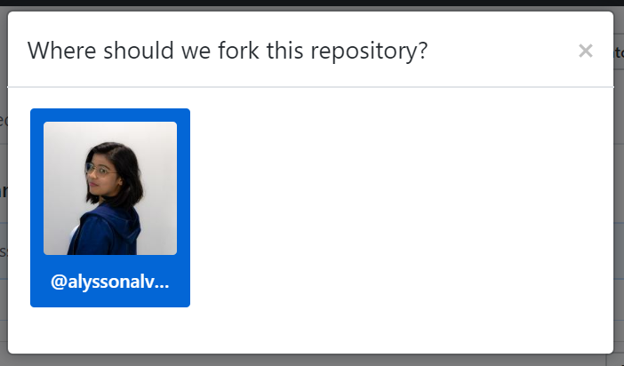
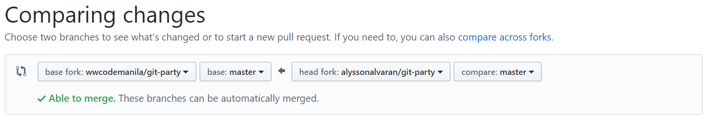
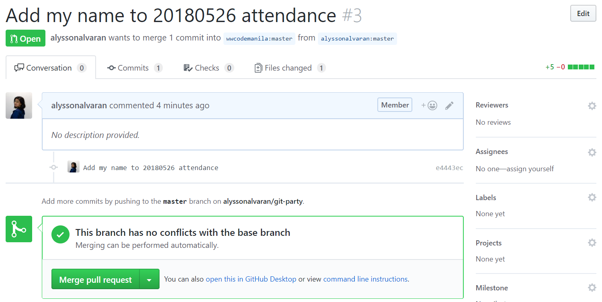
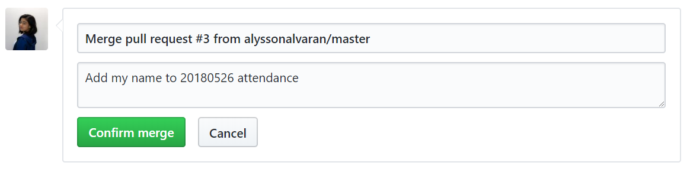

Before we start forking repositories and creating pull requests, let us first discuss where it's most often used for: *open source*.

# Open source

The term **open source** refers to something people can modify and share because its design is publicly accessible.

The term originated in the context of software development to designate a specific approach to creating computer programs. Today, however, *open source* designates a broader set of values — what we call *the open source way*. Open source projects, products, or initiatives embrace and celebrate principles of open exchange, collaborative participation, rapid prototyping, transparency, meritocracy, and community-oriented development.

# Open source software

**Open source software (OSS)** is a computer software program designed and deployed with its source code made available and licensed with a free license in which the copyright holder provides the rights to an anonymous entity for any purpose. Basically, OSS allows anyone to inspect, modify, and enhance its source code.

People using OSS can distribute the software to anyone and for any purpose because open source software is very often developed in a public, collaborative manner.

Here are some famous examples of OSS:
* Linux kernel
* MySQL
* Wordpress
* Mozilla Firefox
* Notepad++

# Why do developers contribute to open source projects?

While some developers start contributing to gain programming experience or build a practical resume, here's what really keeps them motivated to continuously support the open source culture:

**To make things better**. A lot of widely-used OSS such as Linux and Cassandra (from Facebook) started with the idea that there's a better way to do things. When developers are faced with a bug in a software that they're using, they find it really helpful when they can actually offer a solution instead of just reporting the problem. It also serves as a greater motivation to use the software as they become a *part* of how it became what it is today.

**To pay it forward**. As the ones who benefited the most from open source software, developers contribute to open source projects as a way of giving back to the community. After all, programming, and technology in general, wouldn't have progressed as much without open source.

**To have fun**. No matter how noble or inspirational their initial motivations are, they wouldn't have kept contributing if they aren't having fun. According to [Stack Overflow's Developer Survey last 2015](https://insights.stackoverflow.com/survey/2015#profile-sideprojects), the average developer spends more than 7 hours per week working on side projects and open source software, outside of their normal working hours. To quote the results of the survey:

> For many developers, programming is a labor of love.

## Are you ready to contribute?

To become an open source contributor using GitHub, the largest open source community in the world, you need to know how to fork repositories and submit pull requests.

# Forking a repository

A **fork** is a copy of a repository. Forking a repository allows you to freely experiment with changes without affecting the original project.

Most commonly, forks are used to either propose changes to someone else's project or to use someone else's project as a starting point for your own idea.

## Propose changes to someone else's project

A great example of using forks to propose changes is for bug fixes. Rather than logging an issue for a bug you've found, you can:

* Fork the repository.
* Make the fix.
* Submit a pull request to the project owner.

If the project owner likes your work, they might pull your fix into the original repository!

# Forking `git-party`

1. From this repository, `git-party`, navigate to the upper right corner of the page and click the `Fork` button.


2. Select where should the fork be located, which is in this case, your personal account.



That's it! Now, you have a remote copy of the original `git-party` repository.


Now clone the forked repo to create a local copy as well.

```shell
$ git clone https://github.com/<your-name>/git-party.git
```

# Creating a pull request

**Pull requests** let you tell others about changes you've pushed to a repository on GitHub. Once a pull request is opened, you can discuss and review the potential changes with collaborators and add follow-up commits before the changes are merged into the repository.

1. Open your local copy of the repository and go `20180526.md` under the `attendance` folder.

2. Add your name (with a link to your GitHub account) together with a short but interesting fact about yourself.

```shell
* [Alysson Alvaran](https://github.com/alyssonalvaran) - I am mixed-handed or cross-dominant. I write with my left hand but I do everything else with my right! :)
```

3. Push your changes to your `main` branch.

```shell
$ git add attendance/20180526.md
$ git commit -m "Add my name to 20180526 attendance"
$ git push origin main
```

You have now pushed your changes to your fork!

4. Navigate to the original `git-party` repository and click the `New pull request` button.


5. Since we're trying to create a PR from another fork, click the link to `compare across forks`.


6. Select the base fork as `wwcodemanila/git-party` and the its branch as `main`. Compare it against the head fork `<your-name>/git-party` with the same branch.



This would show the changes that you made to your fork compared to the original repository:


7. Submit your pull request!



# Merging a pull request

To merge a pull request with no conflicts with the base branch, just click on the `Merge pull request` button and `Confirm merge`.



In case of conflicts, sync your fork first before resolving the conflicts and pushing your resolution.

# Syncing forks

You need to sync your forks first before pushing your changes and creating pull requests to ensure that you have the latest of the code and won't overwrite what others added.

1. Add the remote `upstream` which references the URL of the original repo.

```shell
$ git remote add upstream https://github.com/wwcodemanila/git-party
```

When pushing your codes to your `main` branch, you'll notice that you also call on a remote named `origin`. To see the remotes that you have, use `git remote`. To see the URL that it references, use `git remote get-url <remote-name>`.

2. Fetch the contents of your `upstream` remote.

```shell
$ git fetch upstream
```

3. Merge the `main` branch of `upstream` to your local fork.

```shell
$ git merge upstream/main
```

Awesome! Your local fork is now up-to-date. You can also merge your remote fork by simply pushing the changes to its `main` branch.

```shell
$ git push origin main
```

# Congratulations!

You're now familiar with forks and pull requests!

**Bonus challenge**: try exploring some open source projects and make a contribution!

# Didn't quite Git it?

Feel free to ask and participate in our [Gitter chat room](https://gitter.im/WWCodeManila/Git)!

# References

* https://github.com/open-source
* https://opensource.com/resources/what-open-source
* https://www.linux.com/blog/top-10-best-open-source-softwares-rocks-world-wide-web
* http://www.tripwiremagazine.com/20-most-popular-open-source-software-ever-2/
* http://www.businessinsider.com/why-developers-contribute-to-open-source-projects-2015-6
* https://www.makeuseof.com/tag/people-contribute-open-source-projects/
* https://insights.stackoverflow.com/survey/2015#profile-sideprojects
* https://help.github.com/articles/fork-a-repo/
* https://opensource.org/about
* https://help.github.com/articles/about-pull-requests/